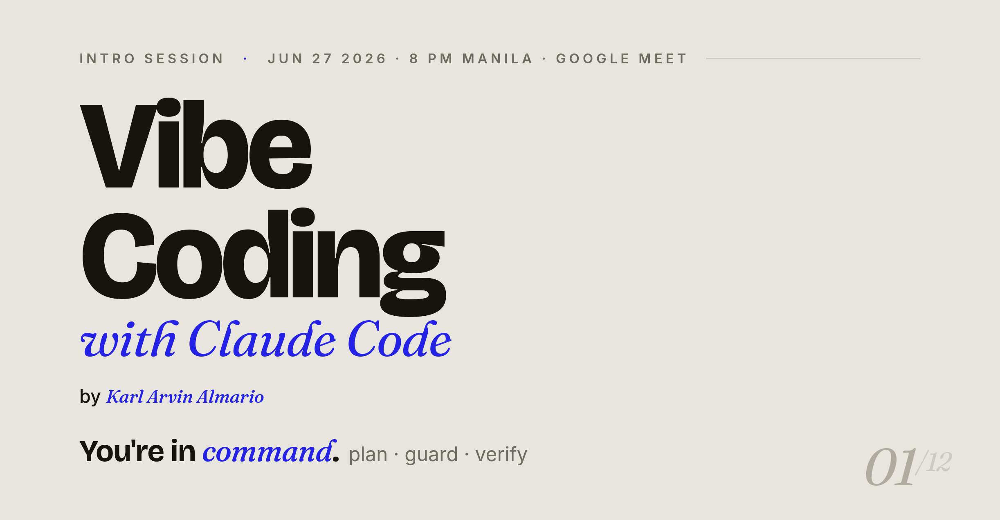
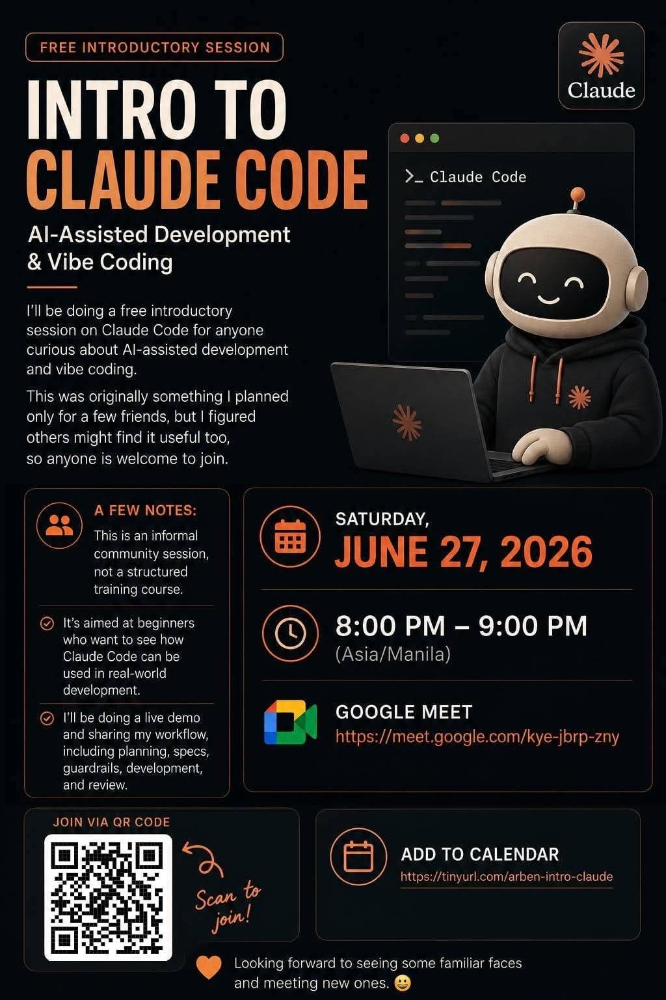
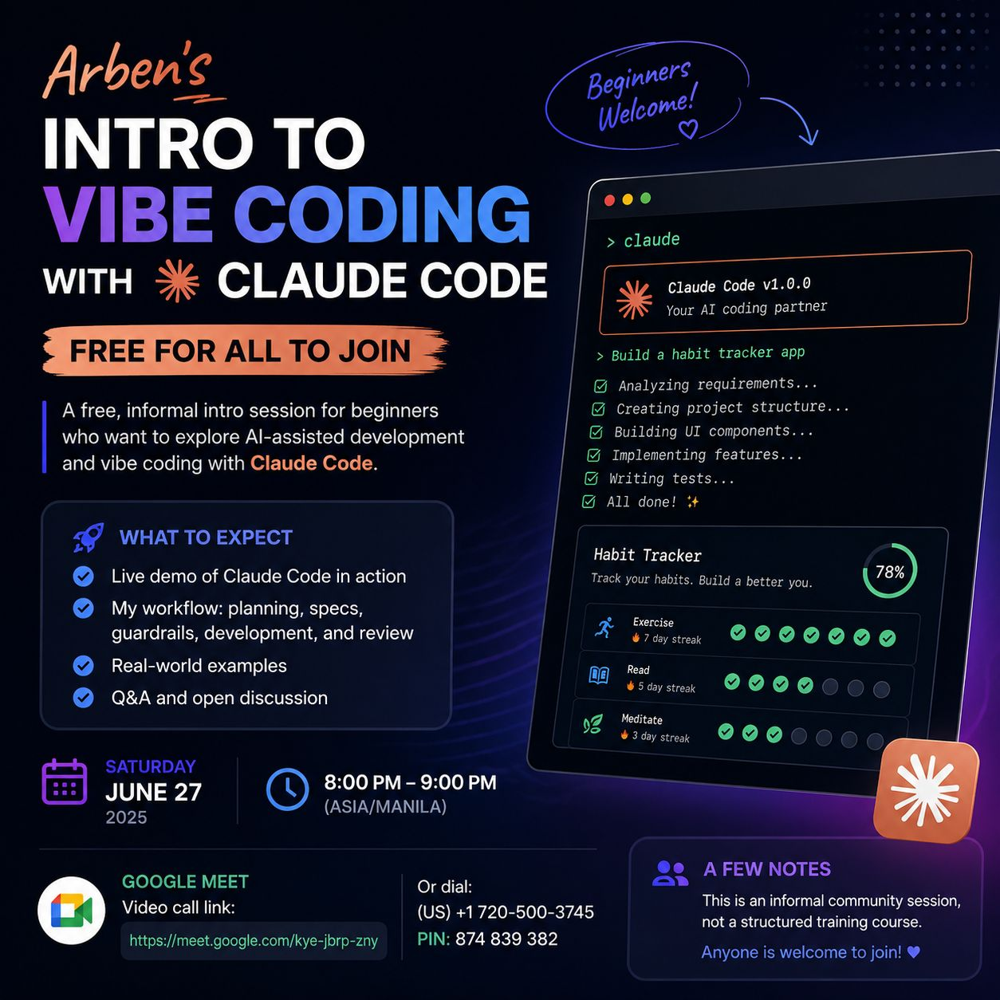

# Vibe Coding with Claude Code



> **An intro session by Karl Arvin Almario. A free community jam, not a course.**

> **Watch the recording:** [youtu.be/A7kqhxOaj1Y](https://youtu.be/A7kqhxOaj1Y)

## The story

A college friend asked me to teach her **vibe coding**: building software by directing an AI instead of typing every line. Instead of teaching just one person, I figured, why not open it up? So this became a free, informal intro session for **anyone** who's curious, beginners especially welcome.

This repo is the whole kit I used to run it: the slide deck, the run-of-show, and the two live demos. It's here so you can **watch the workflow, reuse the materials, or run your own session.**

The one idea the whole talk hangs on: **you're in command.** The AI is a fast, tireless assistant, but it's confidently wrong sometimes, so you stay the author. Plan it, guard it, verify it.

## The session

- **What:** A live intro to AI-assisted development with [Claude Code](https://www.claude.com/product/claude-code). My real workflow, mistakes and all.
- **Who it's for:** Beginners and the curious. No experience needed; if you've never opened a terminal, you're exactly who this is for.
- **When:** Sat 27 June 2026, 8:00 PM (Asia/Manila) · **Where:** Google Meet.
- **Format:** ~20 min of framing, then two demos. *Demo 1* shows how the **prompt** changes the result (two prompts, same page). *Demo 2* walks a finished habit-tracker built with the full **spec → plan → develop → review** loop, then verifies it live with a code review.

## The poster

The invite that went out:





> **Funny tidbit:** the version posted on LinkedIn proudly announces **2025**. The event is actually in **2026**. It shipped before anyone verified the date. A very on-brand "read the diff before you ship it" moment, which is, ironically, the entire point of this talk. We are calling it the vintage edition.

## What's inside

- **[`TRANSCRIPT.md`](TRANSCRIPT.md)**: notes from the live session, the recording link, takeaways, demo walkthrough, and the Q&A.
- **[`SCRIPT.md`](SCRIPT.md)**: the lean run-of-show. Timing and what to say, slide by slide, plus the two demos. Start here to run the talk.
- **[`PREP.md`](PREP.md)**: everything you do *before* the talk, pre-flight checklist, recording/OBS setup, and the full prompts used to build the demo app.
- **`slides/`**: the presentation, as a single self-contained HTML file (two themes).
- **`demos/`**: the source material for both demos.

## Structure

```
demo-kit/
├── README.md                       ← you are here
├── TRANSCRIPT.md                   ← session notes, recording link, takeaways, Q&A
├── SCRIPT.md                       ← lean run-of-show (start here to run the talk)
├── PREP.md                         ← pre-flight, recording setup, full build prompts
│
├── slides/                         ← the presentation decks (open in a browser)
│   ├── intro-claude-presentation.html      ← main deck (typography theme)
│   ├── intro-claude-terminal-theme.html    ← alternate deck (terminal theme)
│   ├── presentation-prompt.md              ← the prompt used to generate the deck
│   └── assets/
│       ├── qr-feedback.png
│       ├── qr-beer.png
│       └── regen-qr.py                     ← edit URLs + run to regenerate the QRs
│
├── demos/                          ← source material for the two live demos
│   ├── demo-1-two-prompts/         ← Demo 1: same page, two prompts
│   │   ├── hero-advance-prompt.md          ← hyper-specific spec
│   │   └── hero-normal-words.md            ← same intent, plain-English
│   ├── demo-2-streak/              ← Demo 2: the workflow (guardrails)
│   │   ├── CLAUDE.example.md               ← simple guardrails
│   │   └── CLAUDE.md.example               ← longer, detailed guardrails
│   └── streak-scaffold/            ← blank React+Vite+Tailwind app + CLAUDE.md
│                                     copy OUTSIDE the repo for the live build
│
└── output/                         ← scratch space for generated apps (dry runs)
    ├── two-prompts/                ← Demo 1 hero pages (advance / normal)
    └── streak/                     ← Demo 2 dry-run build (the live build runs OUTSIDE the repo)
```

## Quick start

1. **Prep first:** work through [`PREP.md`](PREP.md), QR links, pre-build the Demo 1 hero pages, and get the finished Streak app ready at `~/streak-live-for-review`.
2. **Present:** open `slides/intro-claude-presentation.html` → **F** for fullscreen, **← / →** to navigate.
3. **Run the talk** from [`SCRIPT.md`](SCRIPT.md): framing slides → Demo 1 (two prompts) → Demo 2 (show the finished Streak, then `/request-code-review` live) → close.

> Demo 2 runs from a folder **outside** this repo so Claude Code only sees the app, not the kit's other files. The scaffold and full build prompts are in `demos/streak-scaffold` and `PREP.md`.
